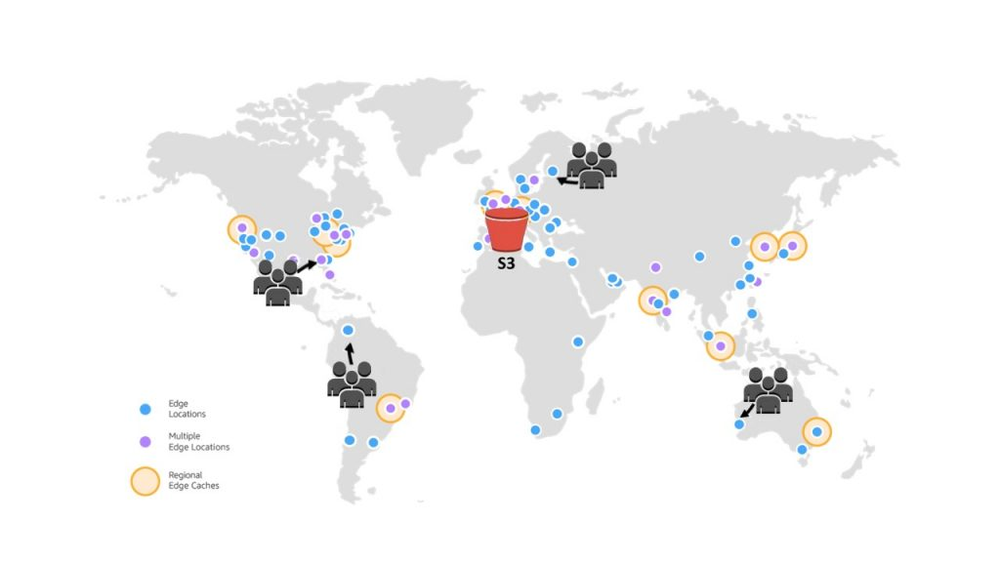

# OTA solution guide for Mini Pupper 2
Target: Build OTA solution in order to make it easy for users to upgrade Mini Pupper 2 MCU software.

Technical architecture: [Amazon S3 + Amazon CloudFront](https://aws.amazon.com/blogs/networking-and-content-delivery/amazon-s3-amazon-cloudfront-a-match-made-in-the-cloud/)



Now status: OTA feature is OK based on S3, but not include CloudFront yet.

Todo: Add CloudFront

This guide comes from hdumcke's [aws-orchestrator](https://github.com/hdumcke/aws-orchestrator), [aws-orchestrator-configurations](https://github.com/hdumcke/aws-orchestrator-configurations) and [multipass-orchestrator-configurations](https://github.com/hdumcke/multipass-orchestrator-configurations) repos.


# Pre-Installation
Open an AWS Cloud Shell to run the below steps.


```sh
### Install pip
cd /tmp
wget --no-check-certificate https://bootstrap.pypa.io/get-pip.py
python3 get-pip.py
pip install boto3
pip install fabric
pip install patchwork
pip install pyyaml
pip install git+https://github.com/hdumcke/aws-orchestrator@main#egg=aws-orchestrator
```

Import a key pair with the name 'aws-orchestrator' and add your public key

Add your private key to the cloud shell. Attention, this provides a security risk and you should remove the file when you are done

mkdir ~/.ssh
vi ~/.ssh/id_rsa # paste your private key
chmod 400 ~/.ssh/id_rsa

# Deploy AWS EC2 build instance

```sh
cd ~
git clone https://github.com/hdumcke/aws-orchestrator-configurations.git
# find a suitable image ID
aws ec2 describe-images --owner amazon | grep -B1 'untu-jammy-22.04-amd64-server-'
# edit ~/aws-orchestrator-configurations/mp_v2_esp_build/config.yaml with your image ID

aws-deploy ~/aws-orchestrator-configurations/mp_v2_esp_build/config.yaml 
aws-wait ~/aws-orchestrator-configurations/mp_v2_esp_build/config.yaml
aws-list ~/aws-orchestrator-configurations/mp_v2_esp_build/config.yaml
#will show similar info: ssh -o UserKnownHostsFile=/dev/null -o StrictHostKeyChecking=no ubuntu@44.200.104.250
#use this IP address for scp
```

# Upload mini_pupper_app.bin to OTA servoer

Copy mini_pupper_app.bin from EC2 instance to cloud shell

```sh
scp -o UserKnownHostsFile=/dev/null -o StrictHostKeyChecking=no ubuntu@<ip addr from aws-list>:mini_pupper_app.bin .
```

Upload mini_pupper_app.bin from your cloud shell to OTA server

```sh
scp -o UserKnownHostsFile=/dev/null -o StrictHostKeyChecking=no mini_pupper_app.bin ubuntu@ota.mangdang.net:
```

ssh to OTA server

```sh
ssh -o UserKnownHostsFile=/dev/null -o StrictHostKeyChecking=no ubuntu@ota.mangdang.net
```

Move mini_pupper_app.bin to right place.

```sh
sudo mv mini_pupper_app.bin /var/www/html/
exit # leave ota.mangdang.net
```

# Close EC2 instance

```sh
aws-destroy ~/aws-orchestrator-configurations/mp_v2_esp_build/config.yaml
```

# Remove your private key

```sh
rm -f ~/.ssh/id_rsa
```
