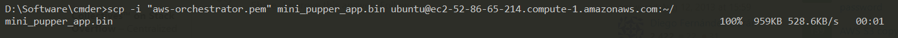

# OTA solution guide for Mini Pupper 2
Target: Build OTA soluiton in order to make it easy for users to upgrade Mini Pupper 2 MCU software.

Technical architecture: [Amazon S3 + Amazon CloudFront](https://aws.amazon.com/blogs/networking-and-content-delivery/amazon-s3-amazon-cloudfront-a-match-made-in-the-cloud/)


Now status: OTA feature is OK based on S3, but not include CloudFront yet.

Todo: Add CloudFront

This guide comes from hdumcke's [aws-orchestrator](https://github.com/hdumcke/aws-orchestrator), [aws-orchestrator-configurations](https://github.com/hdumcke/aws-orchestrator-configurations) and [multipass-orchestrator-configurations](https://github.com/hdumcke/multipass-orchestrator-configurations) repos.


# Pre-Installation
Open an AWS Cloud Shell to run the below steps.


```sh
git clone --depth=1 https://github.com/hdumcke/aws-orchestrator
pip install boto3
pip install fabric
pip install patchwork
pip install pyyaml
python setup.py install
```

# Boot AWS EC2 instance

```sh
cd aws-orchestrator/tests
aws-deploy simple.yaml
aws-wait simple.yaml
aws-list simple.yaml
#will show similar info: ssh -o UserKnownHostsFile=/dev/null -o StrictHostKeyChecking=no ubuntu@44.200.104.250
#then you can run "ssh -o UserKnownHostsFile=/dev/null -o StrictHostKeyChecking=no ubuntu@44.200.104.250" to login your EC2 instance

exit # leave vm
aws-destroy simple.yaml
```

# Build
Compile Mini Pupper 2 esp32 code based on the below steps.

```sh
git clone https://github.com/hdumcke/multipass-orchestrator-configurations
cd multipass-orchestrator-configurations/mp_v2_esp_build/

# build time is about 10minutes.
./build.sh
# you will find new mini_pupper_app.bin file
ls ~/
```

# Upload mini_pupper_app.bin to OTA servoer

## Copy mini_pupper_app.bin from EC2 instance to S3 instance

The steps come from the [aws link](https://aws.amazon.com/premiumsupport/knowledge-center/ec2-instance-access-s3-bucket/).
### 1. Open the [IAM console](https://console.aws.amazon.com/iam).
### 2. Choose Roles, and then choose Create role.


### 3. Select AWS Service, and then choose EC2 under Use Case.


### 4. Select Next: Permissions.
### 5. Create a custom policy that provides the minimum required permissions to access your S3 bucket.


### 6. Select Next: Tags, and then select Next: Review.
### 7. Enter a Role name, and then select Create role.


### 8. Attach the IAM instance profile to the EC2 instance
Open the Amazon EC2 console
Choose Instances
Select the instance that you want to attach the IAM role to
Choose the Actions tab, choose Security, and then choose Modify IAM role.
Select the IAM role that you just created, and then choose Save. 
The IAM role is assigned to your EC2 instance.


### 9. Copy mini_pupper_app.bin from EC2 instance to S3 instance
Go back ES2 console，and try to find your buckets in your S3 instance.


```sh
aws s3 ls
aws s3 cp mini_pupper_app.bin s3://mini-pupper-ota/
```

## Download mini_pupper_app.bin from S3 instance
Go to your S3 instance page, and download mini_pupper_app.bin to your local machine.


## Upload mini_pupper_app.bin from your local machine to OTA servoer

```sh
$scp -i "aws-orchestrator.pem" mini_pupper_app.bin ubuntu@ec2-52-86-65-214.compute-1.amazonaws.com:~/
```



You can get the OTA server(another EC2 instance) on the EC2 instances console.


Move mini_pupper_app.bin to right place.

```sh
sudo mv mini_pupper_app.bin /var/www/html/
```


# Close EC2 instance

```sh
exit # leave EC2 vm
aws-destroy simple.yaml
```